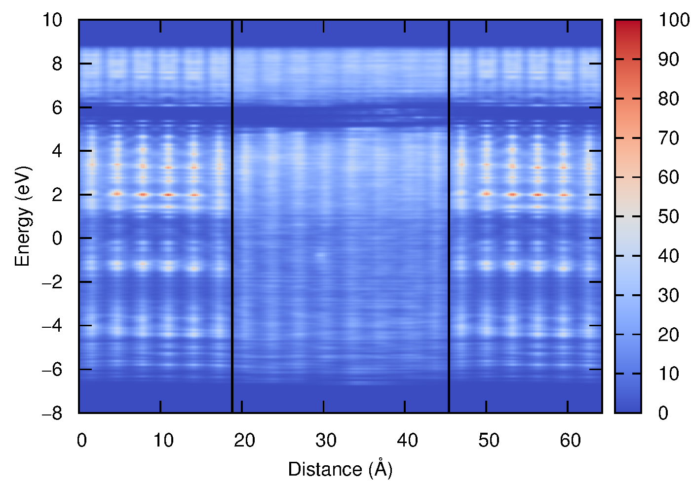

Calculates local (or position-resolved) density of states along z-axis.
This is usefull when invesigating interfaces between two semiconductors, see [here](https://arxiv.org/abs/1610.04119).
The program is a post-processing tool that reads output from the [Vienna Ab initio Simulation Package](http://vasp.at). 

The previous version of the program was based on the PROCAR file. This approach
led to a slightly deformed DOS since delocalized states were underestimated. The
present version also supports k-meshes.

# Installation

In oder to use the program one has to modify the VASP source code, with the provided
patch files. To apply, copy the files to the `/src` folder of your VASP installation and type:
```bash
 patch < fileio.patch
 patch < pardens.patch
```
Continue as you would normally compile VASP.
The modified VASP will generate PARCHG files where the charge density is summed
along 'x' and 'y' directions and printed only along the 'z' direction. This will
save disk space and also reduce the write time of the files.

Finally, you will also need [Gnuplot](http://gnuplot.info) installed on your system.
The color scheme `moreland.pal` was generated by [Bastian Rieck](http://bastian.rieck.ru/blog/posts/2012/gnuplot_better_colour_palettes/)
based on work by [Kenneth Moreland](http://www.sandia.gov/~kmorel/documents/ColorMaps/).

# Usage
First perform a self-consistent calculation to obtain a converged WAVECAR.
Next we will generate PARCHG files for each band and k-point with the following INCAR 
settings:
```
LPARD    = .TRUE.
NBMOD    = 0
LSEPB    = .TRUE.
LSEPK    = .TRUE.
```
After the calculations is finished do:
```bash
mkdir parchg_orig
mv PARCHG* parchg_orig
```
Next one has to change the `dosloc.cc` file to update the cell parameters, position of the 
inteface, number of bands and k-points.

Next compile with `g++ -o dosloc dosloc.cc` and execute the program with `./dosloc`.
The program will generate the file `dosloc-out`.
As a final step run `gnuplot dosloc.plt` to generate the figure `dosloc.eps`.
Gnuplot will require the `moreland.pal` file so that it can read the color pallete.

# Limitations
The program does not understand symmetry so use ISYM=-1 in your INCAR. 

# Example
Localized density of states of the crystalline/amorphous silicon interface.

